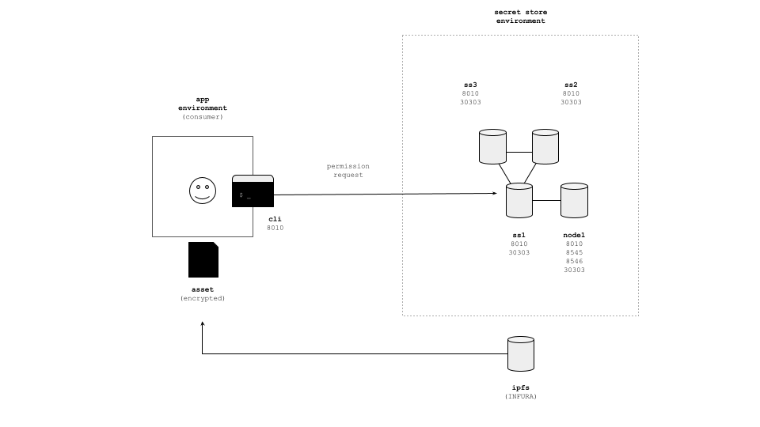

# secret-store-cli

This is Secret Store CLI tool

## architecture



If you are not familliar with how SecretStore works, you can read more details at [Open Ethereum's documentation](https://openethereum.github.io/Secret-Store)

From [documentation](https://openethereum.github.io/Secret-Store):

The Secret Store is a core technology that enables:

- distributed elliptic curve (EC) key pair generation - key is generated by several parties using special cryptographic protocol, so that:
	- private key portion remains unknown to every single party;
	- public key portion could be computed on every party and could be safely exposed to external entities;
	- every party hold the ‘share’ of the private key;
	- any subset of `t+1` parties could unite to restore the private portion of the key;
	- any subset of less than `t+1` parties could not restore the private portion of the key;
- distributed key storage - private key shares are stored separately by every party and are never exposed neither to another parties, nor to external entities;
- threshold retrieval according to blockchain permissions - all operations that are requiring private key, require at least `t+1` parties to agree on ‘Permissioning contract’ state.

## dependency

Here are the local tested versions :

* Ubuntu : Ubuntu 20.04.3 LTS
* OS : macos Monterey 12.0.1
* cargo 1.56.0 (4ed5d137b 2021-10-04)

## build

### for linux

```bash
$ cargo build --release
$ ./target/resease/secret-store-cli
secret-store-cli

FLAGS:
    -h, --help       Prints help information
    -V, --version    Prints version information

SUBCOMMANDS:
    address    Get eth address list
    decrypt    Decrypt document
    encrypt    Encrypt document and receive document key ID and IPFS hash
    help       Prints this message or the help of the given subcommand(s)
```

### for OSX

```bash
$ ./scripts/build-darwin-universal.sh
$ ./target/release/secret-store-cli.bundle
```

## example

see [example](EXAMPLE.md) file how this cli works with secret store.
